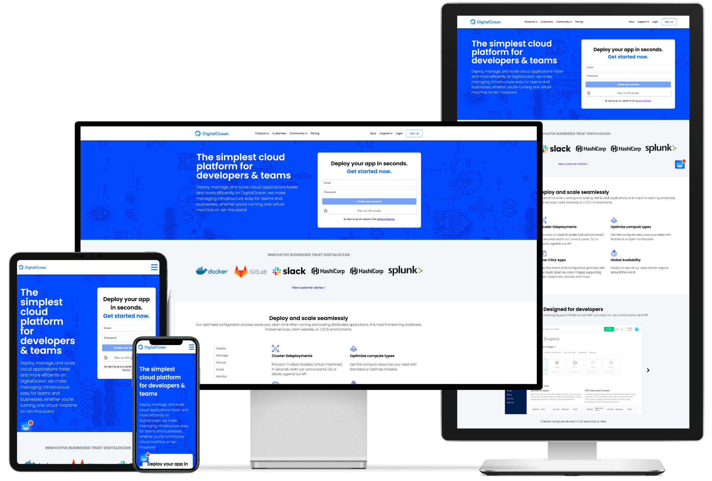

 

<h2 align="center">DigitalOcean</h2>

---

 DigitalOcean landing page demo.

  
    
## ⛏️ Built With 

- [HTML](https://www.mongodb.com/) - Page Structure
- [CSS](https://expressjs.com/) - Page Style & responsive

## ✍️ Authors 

- [@IvanDF](https://github.com/IvanDF) - Design & Develop

See also my [website!](https://github.com/kylelobo/The-Documentation-Compendium/contributors)
New one is in progress.
